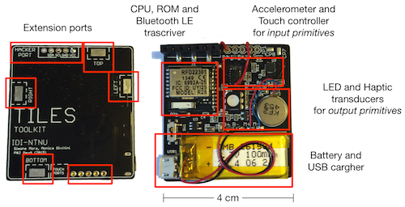

# IoT Squares 

Squares are tiny stickers with electronics that give superpowers to everyday objects. They implement a set of physical interaction primitives.

Squares are part of Tiles, an inventor toolbox to support the design and making of interactive objects for learning and play. For more information tilestoolkit.io

This work is licensed under a [Creative Commons Attribution-ShareAlike 4.0 International License](https://creativecommons.org/licenses/by-sa/4.0/).

## Prototypes History

### Prototype 1
Designed by Norwegian Creation, March 2015

### Prototype 2 Rev A
Designed by Simone Mora, PCB manufacturing and partial assembly from Seeedstudio Fusion Service, November 2015
#### Note: 
* Bug in board design, shortcut between VDD and SDA lines

### Prototype 2 Rev B
Designed by Simone Mora, never produced.
#### Note: 
* Fixed Rev A bugs

### Prototype 2 Rev C
Designed by Simone Mora, PCB manufacturing and partial assembly from Seeedstudio Fusion Service, April 2016
#### Note: 
* Removed touch controller MPR121
* Swapped components no longer available from Seed CPL

### Prototype 2 Rev D
Designed by Simone Mora, PCB manufacturing and partial assembly from Macrofab, November 2016
#### Note:
* Moved from SMD to DIP programming header
* Swapped components not available on Macrofab common parts library
* Added Seeed GROVE I2C connector
